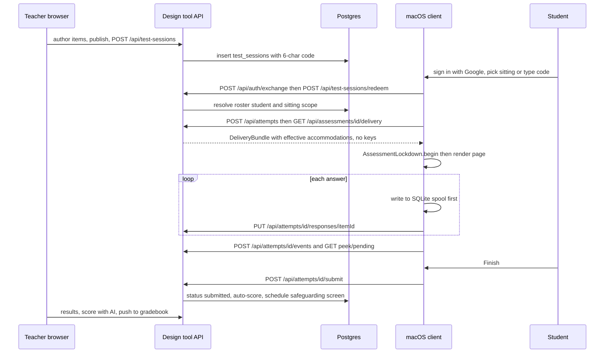

# System architecture

secure-test is one school district's in-house secure assessment stack (MIT licensed, published as-is, not a supported product). It has three moving parts in one bun workspace (`package.json` workspaces: `packages/*`, `design-tool`) plus a Swift client that sits outside the JS workspace.

| Part | What it is | Wiki home |
| --- | --- | --- |
| `design-tool/` | Next.js 16 / React 19 app + REST API. Teachers author, run sittings, monitor, score, export. Drizzle on Postgres. | [design-tool pages](#design-tool-pages) |
| `packages/schema/` | `@secure-test/schema` — Zod wire formats shared by server and (by mirror) the client. | [Wire formats](wire-formats.md) |
| `client/` | macOS AppKit shell around a locked-down `WKWebView`, inside an Apple `AEAssessmentSession`. All logic in the `SecureTestCore` SwiftPM package. | [Client overview](../client/overview.md) |
| `docs/` | Plan, 18 ADRs (`docs/adr/`), one design doc per feature (`docs/*-design.md`), slice trackers (`docs/phase-*-slices.md`). Code comments cite these as "docs/x-design.md, D-n". | read for rationale, not for current behaviour |
| `poc-b-test-loop/`, `poc-c-classlink-sso/` | Feasibility spikes. Kept as empirical record, **not maintained**. `poc-b`'s `items.json` is still parsed by a schema test. | out of scope |

## Design-tool pages

- [Auth and access](../design-tool/auth-and-access.md) — Google OIDC, domain-derived roles, session JWT, the `view < run < edit < own` access ladder, grants, admin, impersonation.
- [Data model](../design-tool/data-model.md) — tables, invariants, migrations.
- [Authoring](../design-tool/authoring.md) — assessments, items, item sets, import/export, PDF import, preview.
- [Sittings and attempts](../design-tool/sittings-and-attempts.md) — the student plane: codes, redeem, attempt, delivery, writes, deadlines, close, peek, events.
- [Scoring and results](../design-tool/scoring-and-results.md) — auto/AI/human scoring, score statuses, results, instant feedback.
- [Reporting and packets](../design-tool/reporting-and-packets.md) — teacher report views, the printable class work packet, and the scoring-corpus run comparison.
- [Integrations](../design-tool/integrations.md) — PowerSchool/Schoology gradebook push, Google Docs release, class insights, email/SNS.
- [Accommodations and roster](../design-tool/accommodations-and-roster.md) — TIDE/OSPI accommodations, effective-accommodation rule, warehouse roster mirror.
- [AI and safeguarding](../design-tool/ai-and-safeguarding.md) — provider abstraction, guardrails, hand-in screening.
- [Deployment and observability](../operations/deployment-and-observability.md) — Docker, CDK, retention, error capture.
- [Testing](../testing/testing-and-validation.md).

## Trust boundaries (the ideas that shape everything)

1. **Two wire formats, on purpose** (ADR 0016). `ItemBundleSchema` (teacher export/share) carries answer keys; `DeliveryBundleSchema` (student) cannot express one. Match/order options additionally get per-attempt HMAC ids. See [wire formats](wire-formats.md).
2. **Role comes from the verified email domain**, never from a token claim (`lib/auth/roles.ts`, ADR 0017). Staff and student sessions are different principals: `requireStaff` vs `requireStudent` / `requireStudentOrPractice`. See [auth and access](../design-tool/auth-and-access.md).
3. **Ownership is a ladder, and refusals are always 404.** Teacher routes call `authorizeAssessment / authorizeSitting / authorizeAttempt` in `lib/api/access.ts`; a student route calls `loadOwnAttempt`.
4. **The client page is a no-origin, fetch-blocked document.** Data leaves only through named `WKScriptMessage` handlers; the renderer is compiled into the signed app today (ADR 0018, which would move it to the server, is only *Proposed*). See [client lockdown](../client/lockdown-and-security.md).
5. **Identity data is district-sourced.** Roster rows are a nightly warehouse mirror (`roster_*` tables), accommodations come from TIDE exports; neither is edited in-app. See [accommodations and roster](../design-tool/accommodations-and-roster.md).

## End-to-end lifecycle

Caption: the normal sitting from authoring to hand-in; the routes named are real handlers under `design-tool/app/api/`.

## Where each concern lives

- HTTP surface: `design-tool/app/api/**/route.ts` (Next route handlers; thin — policy lives in `lib/api/*`). Teacher UI: `design-tool/app/dashboard/**`, `app/admin/**`, `components/`. Server actions: `app/actions/` (`renderContent`, `translateMath`).
- Edge gate: `design-tool/proxy.ts` (Next 16 name for middleware) — mints `x-request-id` for every request and redirects non-staff away from `/dashboard` and `/admin`.
- Database: `design-tool/db/schema.ts` (single file, ~40 tables), `db/migrations/*.sql` (drizzle-kit, numbered `00NN_*`), `db/migrate.ts`.
- Cross-cutting provider seams (mock default, real via env): AI (`lib/ai`), storage (`lib/storage`), guardrail (`lib/safeguarding`), email (`lib/email`), notify (`lib/notify`), roster source (`lib/roster/syncHandler.ts`).

## Stale or misleading existing docs

- `design-tool/README.md` says "Current state (through Slice 34)" and "Seven tables"; the schema now has ~40 tables and far more features (slices 90+). Treat it as history; prefer source and this wiki.
- `packages/schema/README.md` says only single-select MC exists; `ItemSchema` is a discriminated union of ten types.
- `docs/plan.md` describes an AWS Lambda/API Gateway/ClassLink target architecture; the build is Next.js on ECS Fargate (ADR 0014) with Google identity (ADR 0017) and no live-thumbnail capture (AAC redacts the assessment window; peek renders in-process instead).
