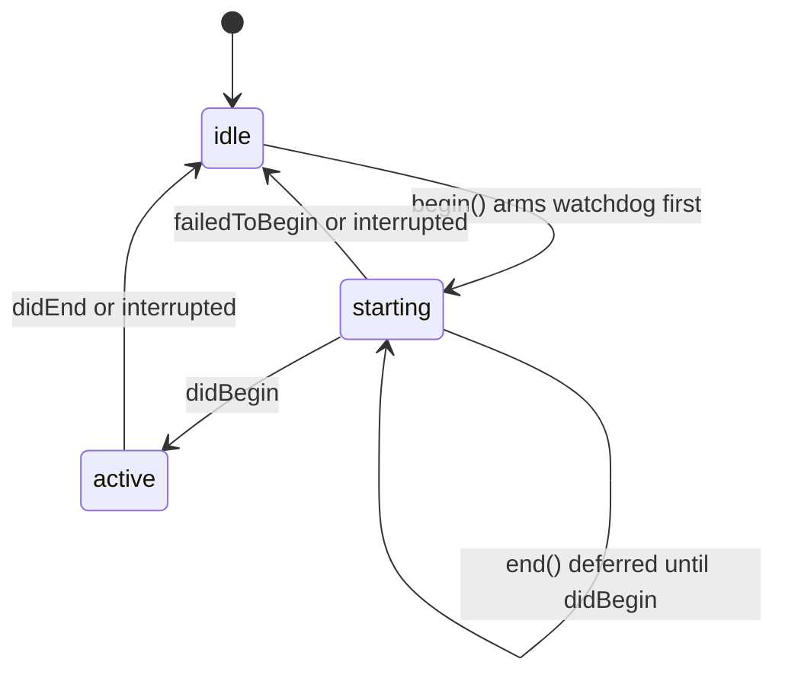

# Client lockdown and security

This page covers how the [macOS client](overview.md) keeps a student inside a test and, equally, how it guarantees a student can always get out. Consult it before touching `AssessmentLockdown`, the web view configuration, the page CSP, message handlers, exit controls or event telemetry.

## Lockdown seam

macOS offers lockdown through `AEAssessmentSession` (Automatic Assessment Configuration, "AAC"). Linking it requires a restricted entitlement (`com.apple.developer.automatic-assessment-configuration`, in `client/SecureTest/SecureTest.entitlements`, with the sandbox keys merged at signing time), so only the signed app target can touch it. The design therefore splits in two:

| Layer | File | Role |
|---|---|---|
| State machine | `SecureTestCore/.../AssessmentLockdown.swift` | `AssessmentLockdown` with states `idle`, `starting`, `active`; watchdog, escalation, teardown handshake; testable with `swift test`. |
| Session protocol | `AssessmentLockdown.Session` | `begin()`, `end()`, `onEvent` delivering `didBegin`, `didEnd`, `failedToBegin`, `interrupted`. |
| Real adapter | `client/SecureTest/RealLockdownSession.swift` | The only file importing `AutomaticAssessmentConfiguration`; maps four delegate callbacks to events and applies a `LockdownConfigurationPlan`. |
| Stand-ins | `SimulatedLockdownSession`, `RefusedLockdownSession` | Simulation for development and CI; a session that fails immediately for a shipped build lacking the entitlement. |

`RealLockdownSession.binaryHasEntitlement` decides which backing is used. A development build without the entitlement falls back to the simulation; a Release build must use `RefusedLockdownSession`, which reports `failedToBegin` so the machine returns to `idle`, the `PageLoadGate` refuses, and the student sees "Couldn't start a secure session" instead of a test on an unlocked Mac. In development, `SECURE_TEST_SIMULATE_LOCKDOWN` (`refuses`, `hangs`, `interrupts`, `slow`) rehearses failure modes on any Mac.

### Which accommodations open lockdown knobs

`LockdownConfigurationPlan(accommodations:)` starts from everything closed and opens only knobs whose accommodation id is present in the delivery bundle's effective accommodation map: `spell_check` to `allowsSpellCheck`, `word_completion` to `allowsPredictiveKeyboard`, `closed_captioning` to live captions. Screenshots, text replacement and autocorrect stay off, and secondary assistive apps (`permissive_mode`) are not yet supported. Dictation cannot be blocked by AAC on macOS (`allowsDictation` is iOS-only), so speech-to-text exceptions are handled by device profile, not code. The server resolves accommodations ([accommodations and roster](../design-tool/accommodations-and-roster.md)); the client only checks presence. In-app text-to-speech is app-side synthesis, not an OS reader.

## Lifecycle and exit guarantees

State machine of `AssessmentLockdown`; a deferred end is paid the moment `didBegin` arrives.

Rules encoded in `AssessmentLockdown` (documented in its header and covered by `AssessmentLockdownTests` and `SimulatedLockdownSlowTests`):

1. **Arm before begin.** Timers go up before `session.begin()`, so no window exists where a session is live and unwatched.
2. **Watchdog is optional and has a floor.** `Timings.watchdog` is nil in a Release build (a ten-minute watchdog had been ending real sessions on the fleet); development arms 600 s, adjustable via `SECURE_TEST_WATCHDOG_SECONDS` only when `allowOverride` is true. The floor is 10 s.
3. **Backstop on its own scheduler.** `backstopScheduler` is separate from the UI scheduler (`LockdownScheduler.swift`), so it still fires if the main thread is stuck.
4. **Confirmed teardown.** `endBeforeTeardown(completion:)` calls `end()`, then waits for `didEnd` up to `Timings.grace` (20 s, with a half-grace log line). If it never confirms, `onUnrecoverable` fires and the app exits the process (the `lockdown_unrecoverable` crash line). The AppKit caller must cancel the quit and re-issue it from the completion, never return `.terminateLater` and wait: a nested run loop starves the completion.
5. **Never `end()` before `didBegin`.** The real framework drops it. `end()` while `starting` sets `endDeferred`; `endIsOwedOnBegin` lets the host avoid building the test for that instant.

Student-reachable exits are the titlebar button, Cmd-E, Cmd-Q, window close and SIGTERM. `ExitConfirmation.shouldConfirm` adds one confirming dialog only while a test is open inside a live session and not yet handed in; system-initiated quits (logout, MDM) are never held up. The default button keeps the student in the test.

`PageLoadGate` (an actor, resolved by `open()` / `refuse()`) holds the page build until lockdown is `active`. Only `Outcome.opened` may build the test; `refused` and `timedOut` send the host home with an explanation. The ordering also fixes a layout bug: the renderer reads viewport width once at build time, and building during the AAC window-resize transition picked the wrong layout.

## Sealed page

- **Document.** `PageShell` assembles HTML loaded with `loadHTMLString(_, baseURL: nil)`, a no-origin document with no `localStorage` or cookies. Item content is never interpolated into markup; the page receives JSON and builds DOM with `textContent` (see `JSONEmbedding`). Only the title is interpolated, through `HTMLEscape`.
- **CSP.** `PageShell.contentSecurityPolicy` is `default-src 'none'` plus inline style and script, and `data:` fonts and images. There is no `connect-src`, so fetch, XHR and WebSocket are blocked, and no `eval`. Everything (KaTeX, fonts, images) is inlined.
- **Web view.** `LockedDownWebView` unregisters dragged types, swallows `rightMouseDown`, nils `makeTouchBar` and `validRequestor` (Services, "Search with Google", Share). `AssessmentViewController` uses a non-persistent data store, disables `javaScriptCanOpenWindowsAutomatically`, and its `decidePolicyFor` allows only the host's own `about:` loads, counted by `pendingHostLoads`; any other navigation is cancelled and logged to the `[security]` channel. The same non-persistent store is used by `WebViewAuthPresenter` for the Google sign-in sheet.
- **Bridge.** Data leaves the page only through eight named script message handlers in `AssessmentViewController`: `response`, `upload`, `submit`, `home`, `withdraw`, `timer`, `tts`, `stt`. Every payload is untrusted. `BridgeItemTable.check` refuses unknown item ids and mismatched response types and over-length text (measured in UTF-16 units, like Zod); `DrawingPayload.pngBytes` bounds base64 size before decoding and requires the PNG signature. Refusals are `BridgeRefusal` values, logged by id and size, never answer text.
- **Limit parity.** `BridgeLimits` mirrors `@secure-test/schema` constants (`ESSAY_TEXT_MAX_LENGTH`, `SHORT_TEXT_MAX_LENGTH`, `ESSAY_HTML_MAX_LENGTH`, `RESPONSE_CELL_MAX_LENGTH`) and the server's `UPLOAD_MAX_BYTES`. `design-tool/test/bridge-limits.test.ts` reads `BridgeChecks.swift` as text and fails on drift, so a limit change needs both sides. See [wire formats](../architecture/wire-formats.md).
- **Future.** ADR 0018 (`docs/adr/0018-server-delivered-renderer.md`, status Proposed) would serve a signed renderer from the design tool; the bridge checks exist because the channel would then become the trust boundary.

## Telemetry and diagnostics

- **Events.** `AttemptEventKind` (quit, emergency_exit, focus_loss, focus_regained, lockdown_begin/end/failed/interrupted, client_error, time_expired, sitting_closed, speech_preflight) mirrors the server's `CLIENT_ATTEMPT_EVENT_KINDS` and is posted to `/api/attempts/:id/events` ([sittings and attempts](../design-tool/sittings-and-attempts.md), [data model](../design-tool/data-model.md)). `AttemptEventReporter.report` returns immediately and posts from a detached task; lifecycle kinds in `retriedKinds` get a bounded retry (up to four attempts, 2/4/8 s). Failures are logged and dropped so an exit is never blocked.
- **Closed sittings.** `PeekResponder` polls `/peek/pending` every 5 s; `PeekPoll.sitting` reading `closed` ends the secure session and returns the student home, and the same poll carries deadline updates and "time limit removed". An unrecognised or absent `sitting` reads as open, so a client never ends a test on news it does not understand. A teacher's peek request renders the frame and shows a visible banner (`PeekNotice`).
- **Errors.** `ClientErrorLog` writes `errors.log` lines (`ClientErrorEntry`, stamped with `AppBuildStamp`); `ClientErrorDrain` posts batches of at most 50 to `/api/client-errors`. `CrashReporter` pre-formats signal lines (SIGABRT, SIGSEGV, SIGBUS, SIGILL, SIGTRAP) ahead of time because a signal handler may only `write(2)`; the drain stamps its own time on them. Server side: [deployment and observability](../operations/deployment-and-observability.md).

## Change navigation

| Intent | Start at | Tests |
|---|---|---|
| Exit path or teardown timing | `AssessmentLockdown`, `ExitConfirmation`, app quit handling in `AppDelegate.swift` | `AssessmentLockdownTests`, `SimulatedLockdownSlowTests`, `ExitConfirmationTests` |
| Open a new AAC knob for an accommodation | `LockdownConfigurationPlan`, `RealLockdownSession.begin()` | `LockdownConfigurationPlanTests` |
| Page CSP or document shell | `PageShell`, `JSONEmbedding`, `HTMLEscape` | `PageShellTests`, `JSONEmbeddingTests` |
| New message handler or payload limit | `AssessmentViewController` channel constants, `BridgeChecks.swift` | `BridgeChecksTests`, `bridge-limits.test.ts` |
| New client event kind | `AttemptEventKind`, server `ATTEMPT_EVENT_KINDS` | `AttemptEventReporterTests`, `attempt-events-api.test.ts` |

Invariants to keep: arm timers before `begin()`; every code path that can call `begin()` ships an exit; a Release build never falls back to a cooperative simulation; handler payloads are validated before spooling. Narrow check: `cd client/SecureTestCore && swift test --filter AssessmentLockdownTests`. The real AAC behaviour cannot be exercised headlessly: changes to `RealLockdownSession` or the web view need a hand-run on an entitled Mac, and `xcodebuild` is only needed when files under `client/SecureTest/` change. Entitlements can be confirmed with `codesign -d --entitlements -` against `client/expected-entitlements.txt`.
