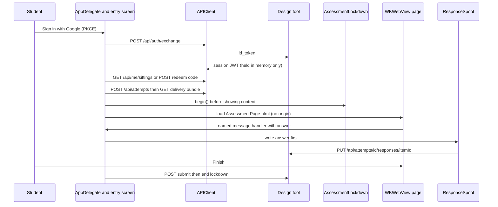

# macOS student client

The student app renders an assessment delivered by the design tool inside a locked-down `WKWebView`. It supersedes `poc-b-test-loop/client` (kept as the empirical record). Consult this page for the shape of the client and its server contract; the lockdown state machine and the web view hardening are in [lockdown and security](lockdown-and-security.md).

## Two targets, on purpose

| Target | Path | Contents |
|---|---|---|
| `SecureTestCore` (SwiftPM, macOS 14) | `client/SecureTestCore/Sources/SecureTestCore/` | Every decision: API client, bundle models, the spool, the lockdown state machine, the page generator, accommodation mapping, [speech](speech-accommodations.md), countdown, event reporting. `swift test` runs it with no Xcode or window server. |
| `SecureTest` (Xcode app) | `client/SecureTest/` plus `SecureTest.xcodeproj` | Thin AppKit shell: `AppDelegate`, `SessionEntryViewController` (sign-in, "Your tests", code entry), `AssessmentViewController` (the web view), `LockedDownWebView`, `RealLockdownSession`, `SpeechListener`/`SpeechReader`, `WebViewAuthPresenter`. |

Why an `.xcodeproj`: SwiftPM packages do not expose the Signing & Capabilities tab where the restricted Automatic Assessment Configuration (AAC) entitlement lives. `RealLockdownSession.swift` is the only file that touches `AutomaticAssessmentConfiguration`; `client/expected-entitlements.txt` records the entitlements a built app should carry (verify with `codesign -d --entitlements -`). The UI cannot be driven headlessly in this environment (per the comments in `APIClient.swift`), so anything not unit-testable in Core is a manual hand-check.

## Student flow

The session JWT lives only in memory (`InMemoryTokenStore`): every launch is signed out and demands a fresh Google sign-in, so nothing outlives the process on a shared lab Mac. The sign-in pieces are `GoogleSignIn.swift`, `PKCE.swift`, `SessionTokenClaims.swift`; the server side is in [auth and access](../design-tool/auth-and-access.md).

## Server contract (`APIClient.swift`)

- Transport is the `HTTPTransport` protocol (`URLSessionTransport` in the app, fakes in tests) and the token store is the `TokenStore` protocol, so every request and response decode is testable offline. Every call sends the version header `X-SecureTest-Version` that the server's `requiredClientUpgrade` reads ([sittings and attempts](../design-tool/sittings-and-attempts.md)).
- Server errors are `{ ok: false, error }`; `APIError.refused(status:code:)` carries the string. Codes the UI branches on: `sitting_closed`, `time_expired`, `attempt_submitted`, `session_unavailable`, `not_on_roster`; a 401 means the 8-hour session ended (`isSessionExpired`).
- Student-plane endpoints used: `/api/me/sittings` (`MySittings`), `/api/test-sessions/redeem`, `/api/attempts`, `/api/assessments/:id/delivery`, `/api/attempts/:id/responses/:itemId`, upload slots, `/events`, `/peek/pending`, `/submit`, `/api/client-errors`.
- Configuration (`ClientConfiguration`) resolves the server URL and Google client id from launch argument, environment, then MDM managed preference; a Release build inverts the order so a managed preference always wins.

## Wire-format mirror

`DeliveryBundle.swift` and `DeliveryItem.swift` are the Swift mirror of `DeliveryBundleSchema`: an enum with associated values so a `switch` without a default is exhaustive and a new item type breaks the build everywhere it must be handled. `AttemptEventKind` mirrors the server's client-postable event set (`CLIENT_ATTEMPT_EVENT_KINDS`); a new kind must land on both sides together because the server answers 400 to unknown kinds. `GeneratedKatexMacros.swift` is generated from `K12_MACROS` by `client/scripts/vendor-katex.mjs` (fonts by `vendor-fonts.mjs`); never edit it by hand. See [wire formats](../architecture/wire-formats.md) for the recipe that keeps both sides in step.

## Durability: the spool

`ResponseSpool` (an actor over the system SQLite C API, WAL mode) keys rows by (attempt, item) with latest-write-wins, mirroring the server's unique constraint; a `nil` payload is a withdrawal. Rows refused with 409 `sitting_closed` are **held** (`deferred_at` column) rather than dropped, because the same attempt resumes through the next sitting and the write is then accepted. Other permanent refusals are dropped. `UploadGate` and the drawing flow use registered upload slots (presigned to S3 where available, otherwise via an authenticated app route).

## The page

`AssessmentPage.html(...)` builds the whole document from the delivery bundle's **original JSON bytes** (not a re-encoding of the Swift model, so unknown fields are never dropped), vendored KaTeX, item styles and the renderer script, via `PageShell`. `JSONEmbedding.escapeForScriptElement` escapes `<`, `>`, `&`, U+2028/9. Page features are separate files: paging (`BackToTests`, layout), `PageAccommodations` (contrast, font, zoom as attributes on `<html>`), `TextToSpeech`/`SpeechToText`/`MathSpeech`, `TimeLimitCountdown`, `InstantFeedbackPage`, `PeekResponder`/`PeekNotice`. The renderer is compiled into the app today; ADR 0018 (serve it from the design tool, signed) is only Proposed, and `BridgeChecks.swift` already treats every page message as untrusted input.

## Change navigation

| Intent | Start at | Tests |
|---|---|---|
| New or changed item rendering | `AssessmentPage*.swift` renderer script, `DeliveryItem.swift` | `Renderer*Tests.swift` (e.g. `RendererMatchTests`, `RendererFillBlankTests`) run through `RendererHarness.swift` |
| New API call or error code | `APIClient.swift`, `JoinOutcome.swift`, `JoinErrorCopy.swift` | `APIClientTests`, `JoinOutcomeTests` |
| Changed delivery field | `DeliveryBundle.swift` | `DeliveryBundleTests` plus the TypeScript `delivery.test.ts` |
| Offline/durability behaviour | `ResponseSpool.swift`, `UploadGate.swift` | `ResponseSpoolTests`, `UploadGateTests` |
| Time limit or closed-sitting UX | `TimeLimitCountdown.swift`, `AttemptEventReporter.swift` | `TimeLimitCountdownTests`, `RendererTimeLimitTests`, `AttemptEventReporterTests` |

Narrow check: `cd client/SecureTestCore && swift test --filter <TestClass>`. The full `swift test` is moderate; `xcodebuild` of the app is conditional on changes under `client/SecureTest/` or the project file. Never hand-edit generated or vendored resources (`GeneratedKatexMacros.swift`, `Resources/katex`, `Resources/fonts`); rerun the vendor scripts.

Related: [architecture overview](../architecture/overview.md), [testing](../testing/testing-and-validation.md).
