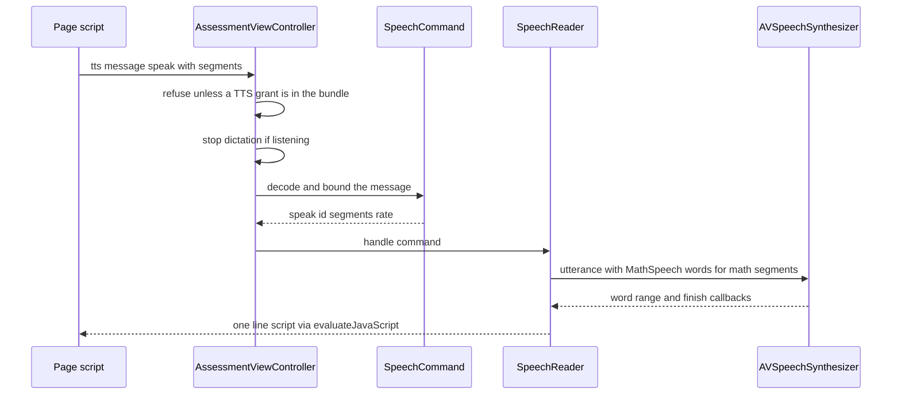

# Speech accommodations in the macOS client

Speech supports are TIDE-granted accommodations that the macOS client delivers inside the locked session. The design tool decides who gets them ([accommodations and roster](../design-tool/accommodations-and-roster.md)); the client decides what the page may show and when the Mac may speak or listen. Decisions live in `SecureTestCore` so `swift test` can exercise them without a window. The app target owns only the audio hardware and system speech objects. The design rationale is in `docs/speech-tools-design.md` (decision ids D-1 to D-6 are cited in the source comments).

## Which grant does what

| Accommodation id | Client reading | Control drawn |
|---|---|---|
| `tts_test_content` | TIDE values `Items`, `Stimuli`, `Stimuli+Items`; any other enabled value is read as both | Speak on each question stem (`items`) and each stimulus or labelled source (`stimuli`) |
| `tts_for_ela_reading` | Any enabled value is stimulus read-aloud (D-5), unioned with the above | Speak on stimuli and sources |
| `tts_student_responses` | Off or On | "Read my answer" beside each short-text, essay, outline and table field |
| `speech_to_text` | Off or On; English only (`speech_to_text_language` is not read, D-6) | "Speak my answer" dictation control |

`TextToSpeechScope(accommodations:)` resolves the three TTS ids into `items`, `stimuli` and `responses`. `SpeechToText.isGranted` resolves dictation. Both go through `PageAccommodations.enabledValue`, which repeats the server's off-value rule, so a row the server let through still cannot enable a tool. The server drops off-ish values before the bundle is built (`isEnabledValue` in `design-tool/lib/accommodations/effective.ts`).

The page receives its grants as constants, `TTS_SCOPE` and `STT_STATE`, beside the bundle. A page without them draws no speech controls at all.

## Read-aloud flow

Caption: read-aloud messages are refused without a grant, and each speak replaces the previous utterance. Pause, resume and stop are separate actions on the same channel.

- `SpeechCommand.decode(fromMessageBody:)` in `TextToSpeech.swift` is the boundary check. It rejects unknown actions, unknown segment kinds and missing fields, and it enforces `BridgeLimits.speechMaxSegments` and the character cap before any work is done. An unknown `rate` falls back to normal speed rather than refusing the message.
- `SpeechScript` turns the segments into the utterance text. `MathSpeech.words` reads each `math` segment. It is all-or-nothing: an expression outside its subset becomes the phrase "math expression" instead of a half-read formula.
- `SpeechReader` (app target) owns one `AVSpeechSynthesizer` and maps each delegate callback to a `SpeechCallback` script for the page. It does not persist anything.

## Dictation flow and pre-flight

The microphone and recognition permissions are settled before lockdown begins, not during the test. PoC-A finding #16 showed that a first permission prompt inside an `AEAssessmentSession` is hidden behind the lockout and hangs, so the rule is structural:

1. After the bundle arrives, `AssessmentViewController` runs `SpeechPreflight.run` only if `SpeechToText.isGranted` is true. Steps run in order: microphone, recognition, transcriber availability and assets. The whole pre-flight has a 20 s budget (`SpeechToText.preflightBudget`).
2. `SpeechToTextPreflight.availability` is `ready` only when every step answered yes. Otherwise it is `unavailable`, and the page shows no control and a notice to tell the teacher.
3. The result is reported once as a `speech_preflight` attempt event with `outcome` (`ready`, `denied`, `timed_out`, `unavailable`) and, when a step failed, `step` (`microphone`, `recognition`, `transcriber`, `assets`). The server accepts this event only with those closed values, and the Monitor reads the newest one. It is not an alert.
4. Only then does `onBundleLoaded` start lockdown. `handleDictation` refuses any `stt` message unless the stored availability is `ready`.
5. `SpeechListener` (app target) runs an `AVAudioEngine` tap into a `SpeechTranscriber` with volatile results. `DictationCommand.decode` carries `listen` with the text before and after the caret and a single-line flag. Volatile phrases are only shown, and final phrases are inserted once. Listening stops after 60 s (`maxListen`), after 10 s of silence (`silenceLimit`), on the student's stop press, when the page starts read-aloud, and on every session exit (hand-in, teardown, quit).

Invariant: every `stop` path is also a teardown path. `AssessmentViewController.stopSpeech` and `stopListening` are called beside each other on every way off the attempt screen, so no microphone or synthesizer outlives the session.

## Change navigation

- Adding a speech-related accommodation id: add it to the catalog and the server visibility rules first ([accommodations and roster](../design-tool/accommodations-and-roster.md)), then read it in `TextToSpeechScope` or `SpeechToText.isGranted`. Remember the page constants (`TTS_SCOPE`, `STT_STATE`) are what the renderer sees.
- Changing what is spoken: `MathSpeech` (subset and fallback) and `SpeechScript` (segment join). Keep the all-or-nothing rule, because a partial formula reading is worse than the fallback phrase.
- Changing the pre-flight outcome vocabulary: update the Swift `EventOutcome` and `Step` enums together with the server's `SPEECH_PREFLIGHT_OUTCOMES` and `SPEECH_PREFLIGHT_STEPS` in the attempt events route. Mismatched values are rejected by the server.
- Focused tests (run under `swift test`, no Xcode window): `SpeechToTextTests` (grant, availability, outcome mapping, `DictationCommand` decoding), `TextToSpeechTests` (scope resolution, `SpeechCommand` decoding and bounds), `MathSpeechTests`, `RendererTextToSpeechTests`, `RendererSpeechToTextTests`, `RendererResponseSpeechTests` (the page's controls), `BridgeChecksTests` (message size limits), and `AttemptEventReporterTests` (`speech_preflight` wire value).
- `SpeechListener.swift`, `SpeechReader.swift` and the handlers in `AssessmentViewController.swift` are in the app target and are not covered by `swift test`. Verify them with an Xcode build and a manual run on a Mac that has the assets installed.
- Scope boundary: the speech grants are data the server already emits in the bundle's accommodation map. Changing which keys or values that map carries is a wire change; see [wire formats](../architecture/wire-formats.md). Pure rule changes inside `SecureTestCore` do not need a server change.

Related: [client overview](overview.md) (the SwiftPM split and the page pipeline), [lockdown and security](lockdown-and-security.md) (how the lockdown session and the `speech_preflight` event fit into begin and teardown).
 and the `speech_preflight` event fit into begin and teardown).
