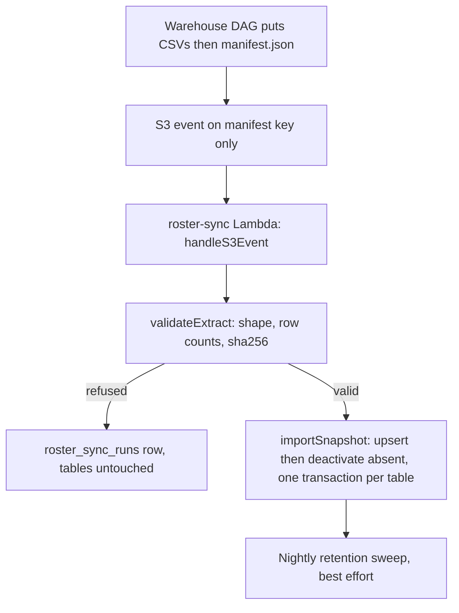

# Accommodations, TIDE import and the warehouse roster mirror

Two data sources decide what a student sees and whether they may sit a test. The **roster** (who exists, who teaches whom) comes from the district warehouse. **Accommodations** (what support each child is entitled to) come from TIDE and teacher edits. The student plane joins them at the moment of redeeming a code ([sittings and attempts](sittings-and-attempts.md)).

## Effective accommodations

`resolveEffectiveAccommodations` and the pure rule `explainAccommodations` (`lib/accommodations/effective.ts`) answer: which tools does this student get on this assessment, and which of those are construct-altering? The delivery route calls it and ships the result as `DeliveryBundle.accommodations` (tool id to setting value) ([wire formats](../architecture/wire-formats.md)); the teacher's "who gets what" preview calls the same rule, so preview and delivery cannot disagree.

Inputs, from broadest to most specific:

1. `assessments.allowed_accommodations`: what the assessment permits at all (a construct-validity decision). An empty list yields nothing, exceptions included.
2. The student's live `student_accommodations` rows. TIDE stores a value for every tool, so `isEnabledValue` treats `""`, `off`, `none`, `none (default)` and `default` as not enabled.
3. Class-period grants (`assessments.section_accommodations`, `lib/accommodations/sections.ts`): everyone in a section gets the tool if the period allows it, but a value already on the student's record wins.
4. `assessment_student_overrides` (per-assessment exceptions). With `assigned_scope = teacher` an exception can grant a tool outside the allowed list (and that tool is then flagged construct-altering, because nobody vetted it). With `school` or `district` the allowed list gates exceptions. An **Off** exception revokes in both cases.

`construct_altering` is always a subset of `allowed_accommodations`, enforced in the API layer (`lib/api/assessments.ts`) and clamped when the allowed list shrinks. The tool vocabulary is `lib/accommodations/catalog.ts` (OSPI tiers, with implementation tiers T1 to T4 and out-of-band), with the TIDE catalogue in `lib/accommodations/tide-catalog.json` regenerated by `scripts/generate-tide-catalog.ts`.

## TIDE import and the overlay

`students` is a **per-teacher overlay** keyed by `(owner_sub, ssid)` and, once a student has joined, `(owner_sub, roster_ps_id)`. The same child has a different overlay row under each teacher, which is why `loadOwnAttempt` resolves against the assessment owner (`sittingTenantSub`) and not the sitting owner, so co-teacher sittings still find the right row.

`POST /api/accommodations/import` (`lib/api/importTide.ts`, `exceljs`) applies fixed merge semantics: values from a TIDE import overwrite `tide_import` rows, a teacher-edited row (`tide_then_edited`) is preserved and surfaced as a diff to accept or keep (`accept-tide`, `keep-mine` routes, review page `app/dashboard/accommodations/import/review`), `manual` rows are never touched, rows absent from the new import are soft-removed, and unknown tool ids are dropped. Deleting a TIDE-origin row returns 409. Soft-deleted ledger rows do not block re-insertion (partial unique index).

## Student identity binding

`resolveStudentForOwner` (`lib/api/resolveStudent.ts`) answers three ordered questions:

1. **Who**: exactly one active `roster_students` row matches the session's lowercase email (`not_on_roster` for none, `identity_conflict` for two).
2. **Whether**: if a sitting is given, either the explicit `student_ps_ids` list admits them, or they are currently enrolled in a section the sitting owner currently teaches (optionally one named section). `roster/queries.ts` applies the date checks (`start_date`/`end_date`, `dateenrolled`/`dateleft`).
3. **As whom**: find or bind the overlay row, first by `roster_ps_id`, then by SSID (so TIDE rows get matched), and only on an admitted join create one. A student merely probing a route never leaves a row. A staff principal skips the roster and resolves only to its own practice overlay.

It refuses rather than guesses, because a wrong binding would score one child's answers under another's name. `resolutionLog.ts` logs the real reason; the HTTP surface collapses some reasons (see redeem in [sittings and attempts](sittings-and-attempts.md#join-and-answer-flow)).

## Roster sync

Contract: `docs/roster-extract.md` in the repository (five objects under `roster/<snapshot_id>/`: four CSVs and `manifest.json`, written last). The decision is ADR 0017 (warehouse extract instead of ClassLink).

Nightly snapshot import path. A refused extract is recorded with counts and reason only and leaves last-known-good data in place.

- `lib/roster/extract.ts` validates the manifest (`format_version` is literally 1, `files` map or list form, bare file names, row counts, lowercase hex sha256) and the CSV shape before anything is written.
- `lib/roster/importSnapshot.ts` upserts each table and then deactivates rows the snapshot did not carry, inside one transaction per table in foreign-key order. Every row is stamped with `last_seen_snapshot_id`; absence is detected by comparing stamps, not a `NOT IN` over thousands of keys. Re-importing the same snapshot changes nothing.
- `lib/roster/syncHandler.ts` is the Lambda's logic (the CDK wrapper is `design-tool/infra/lambda/roster-sync.ts`). `SnapshotSource` has three implementations: `S3SnapshotSource` in production, `MockSnapshotSource` in tests, and a directory source for manual runs. Only the manifest key triggers an import; the handler also runs the retention sweep ([deployment and observability](../operations/deployment-and-observability.md)).
- Logging rule: counts and codes only, because Lambda logs go to CloudWatch and must never name a student.
- Section teacher roles drive `lib/roster/coTeachers.ts` suggestions ([auth and access](auth-and-access.md#the-access-ladder-docsaccess-model-designmd)). `lib/roster/teacherRoster.ts` supplies display names and section labels used by results and attendance.

## Change navigation

- Changing which tools a student gets: edit the pure rule in `explainAccommodations`, then confirm `delivery-api.test.ts` and `accommodations-preview*.test.ts` still agree.
- Adding a tool: add it to `catalog.ts`; a client only honours tools it knows. If it changes rendering, handle it in the client's `PageAccommodations` or lockdown plan ([lockdown and security](../client/lockdown-and-security.md)).
- Changing the extract: bump `format_version`, update `docs/roster-extract.md`, `lib/roster/extract.ts` and its tests together. The importer must keep refusing versions it does not know.
- Do not add a hard delete to roster sync; deactivation is how last-known-good survives a bad night.
- Tests: `effective-accommodations.test.ts`, `section-accommodations.test.ts`, `coteach-accommodations.test.ts`, `tide-import.test.ts`, `tide-catalog.test.ts`, `student-accommodations-api.test.ts`, `resolve-student.test.ts`, `roster-extract*.test.ts`, `roster-import.test.ts`, `roster-queries.test.ts`, `roster-sync-handler.test.ts`. Test fixtures use synthetic ids (`roster-fixture-synthetic-ids.test.ts`), and no real student data may be committed.
