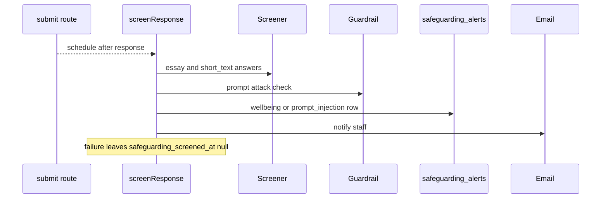

# AI providers, guardrails and safeguarding screening

AI shows up in many places in the design tool, but always behind the same shape: an interface, a `mock` implementation that is the default, a Bedrock implementation, sometimes a direct Anthropic implementation, and a selector function that reads one environment variable. Read this page before adding a new AI feature or changing how model output reaches a teacher or student.

## Provider selectors

| Surface | Selector | Env var (default) | Notes |
|---|---|---|---|
| Item generation (single and batch) | `getProvider()` in `lib/ai/provider.ts` | `AI_PROVIDER` (`mock`; `bedrock`, `anthropic`) | Claude Sonnet 4.6 on Bedrock per ADR 0007. Route `app/api/ai/generate-item(s)`, gated by `assessment.allow_llm_authoring`. |
| Math notation translator | `lib/ai/mathTranslator/provider.ts` | `MATH_TRANSLATOR_PROVIDER` (`mock`) | Claude Haiku 4.5. Server action `app/actions/translateMath.ts`. Always on, since it is a notation converter, not authoring. ADR 0011. |
| PDF import extractor | `lib/pdfImport/provider.ts` | `PDF_EXTRACTOR_PROVIDER` (`mock`) | Scanned PDFs go to Bedrock document blocks (ADR 0015). See [authoring](authoring.md#getting-content-in-and-out). |
| Essay scorer | `lib/ai/essayScorer/provider.ts` | `ESSAY_SCORER_PROVIDER` (`mock`) | Used by `lib/scoring/aiScoreResponse.ts`. See [scoring](scoring-and-results.md). |
| Rubric extractor | `lib/ai/rubricExtractor/provider.ts` | `RUBRIC_EXTRACTOR_PROVIDER` (`mock`) | Rubric upload to structured rubric. |
| Guardrail | `lib/safeguarding/provider.ts` | `GUARDRAIL_PROVIDER` (`off`; `mock`, `bedrock`) | `null` when off: callers run the AI call directly and write no telemetry. |
| Hand-in screener | `lib/safeguarding/screening/provider.ts` | `SAFEGUARDING_SCREENER_PROVIDER` (`off`; `mock`, `bedrock`) | Off means the hand-in does no extra work. |
| Email, notify | `lib/email/provider.ts`, `lib/notify/provider.ts` | `EMAIL_PROVIDER`, `NOTIFY_PROVIDER` (`mock`) | SES and SNS in production. |

Shared plumbing: `lib/ai/bedrockConverse.ts` (Converse + tool-use over SigV4), `lib/ai/anthropicClient.ts`, `lib/ai/sdkResponse.ts`, and the `*Core.ts` files (`itemGenCore`, `itemBatchCore`, `standardsSuggestCore`, `mathCore`, `scoreCore`, `extractCore`) which hold prompts and validation shared by mock and real providers. Model output is never trusted: item proposals pass through `CreateItemBody.safeParse`, math through `mathNormalize`, fill-in-the-blank through `fillBlankNormalize`, and class-insight text through the claim checks described in [integrations](integrations.md#class-insights).

Adding a vendor or surface: implement the interface in the surface's `types.ts`, add a branch to the selector, keep `mock` as the default, document the env var, and add a test beside `bedrock-provider.test.ts` / `anthropic-provider.test.ts` that stubs the SDK. Real-provider smoke scripts exist (`scripts/bedrock-smoke.ts`, `scripts/guardrail-smoke.ts`) but are conditional manual checks needing AWS credentials, not part of ordinary validation.

## Guardrail wrapper (ADR 0012)

`runGuarded` (`lib/safeguarding/guard.ts`) wraps an AI call with a pre-check and a post-check against the configured `GuardrailProvider` and records every check in `guardrail_events`. Telemetry persists only a snippet of at most 500 characters, strips `detail` from findings that could hold the matched text (`pii`, `blocked_word`), and replaces the snippet entirely when a PII finding fired. Blocked-word snippets are kept on purpose because the term is operator-configured and triage needs the context. The wrapper is called by the item-generation routes, the math translator action, PDF import, rubric extraction, standards suggestion, AI essay scoring (`aiScoreResponse.ts`) and the class-insights report and chat routes; `guardrail_events` rows are swept after 90 days ([deployment and observability](../operations/deployment-and-observability.md#retention-sweep)).

## Hand-in screening and alerts

Screening after hand-in. The submit response never waits for it.

- `scheduleAttemptScreening` (`lib/safeguarding/screening/screen.ts`) uses Next's `after()` so the hand-in response is sent first. It screens only `essay` and `short_text` responses that are unscreened or edited after their last screening (`safeguarding_screened_at < updated_at`).
- Two alert kinds in `safeguarding_alerts`: `wellbeing` (the screener names any non-`none` category, with no confidence threshold) and `prompt_injection` (the screener's injection half **or** the guardrail's PROMPT_ATTACK filter, because they miss different things).
- A prompt-injection alert withholds AI scoring for that answer. `injectionAlertFor` (`lib/safeguarding/alerts.ts`) finds it; acknowledging does not release the score, only an explicit "Score with AI anyway" (`ai_forced_at`) does. The Google Docs release also skips students with open alerts (see [integrations](integrations.md#google-docs-release)).
- Retry: `register()` in `instrumentation.ts` calls `startScreeningRetry` (`screening/retry.ts`), an hourly in-app timer (`RETRY_INTERVAL_MS`) over hand-ins from the last 14 days, 200 per run, after a 10-minute grace. It lives in the app and not the roster Lambda because the Lambda sits in isolated subnets with no route to Bedrock. Lazy screening also happens just before a teacher's Score with AI.
- Surfaces: `app/api/admin/safeguarding-alerts`, `app/api/assessments/[id]/safeguarding-alerts`, `app/api/safeguarding-alerts/[alertId]/acknowledge`, pages `app/admin/safeguarding` and the per-assessment alert views; staff email via `lib/email/safeguardingNotifications.ts`.

## Change navigation

- Start at the selector for the surface, then its `*Core.ts`. Keep prompts and validators in the core file so mock and real providers cannot diverge.
- Anything that sends student text to a model must go through `runGuarded` and must not log the text (`lib/log.ts` redaction contract).
- Tests: `safeguarding.test.ts` (guard and telemetry), `safeguarding-screening.test.ts` (screen, retry, dedupe), `safeguarding-route.test.ts`, `safeguarding-alerts-ui.test.tsx`, `essay-scorer.test.ts`, `ai-generate*.test.ts`, `math-translator.test.ts`, `math-normalize.test.ts`, `pdf-extract.test.ts`. DB-backed ones need the `_test` database ([testing](../testing/testing-and-validation.md)).
- Escalate to a broader review when a change alters which student text leaves the app, adds a new vendor, or changes alert semantics. Those carry privacy and DPA implications recorded in ADR 0012 and 0014.
