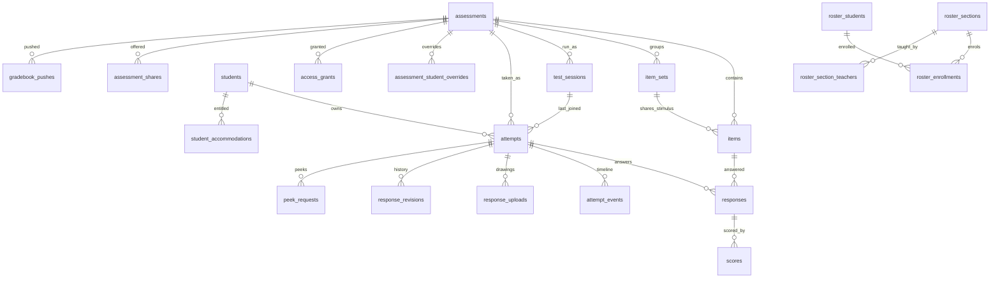

# Database schema and migrations

Consult when adding a column/table, changing a status vocabulary, or reasoning about cascade/retention. The single schema file is `design-tool/db/schema.ts` (Drizzle, `postgres` driver; `getDb()` in `db/client.ts` caches one pool of 5 from `DATABASE_URL`). Closed vocabularies are exported as `as const` arrays (e.g. `ITEM_TYPES`, `ATTEMPT_EVENT_KINDS`) and mirrored in SQL `CHECK` constraints and route-level Zod enums — add to all three.

## Entity map

Diagram: core relationships only. `students.roster_ps_id` is a plain text bridge to `roster_students.ps_id` (deliberately no FK); `access_grants` is keyed on email, not an FK to a user table; `rubrics` is linked to items by provenance id only.

## Tables by domain

| Domain | Tables | Notes |
| --- | --- | --- |
| Authoring | `assessments`, `items`, `item_sets`, `assets`, `rubrics` | `items.config` is a jsonb bag (`ItemConfig` type) holding per-type extras **and the answer key** (pairs, sequence, regions, `cell_keys`, `blanks`, rubric, `scoring_method`); write-boundary validation is in `lib/api/items.ts`, not the column. `assessments.status` is `draft`/`published` (publish locks edits — `requireDraft`). `archived_at` is soft-hide, not a status. See [authoring](authoring.md). |
| Accommodations overlay | `students`, `student_accommodations`, `assessment_student_overrides` | `students` is a **per-teacher** overlay (`owner_sub`), not the roster; unique on (`owner_sub`, `ssid`), (`owner_sub`, `roster_ps_id`) and practice (`owner_sub`, `practice_for_sub`). See [accommodations and roster](accommodations-and-roster.md). |
| Sittings and attempts | `test_sessions`, `attempts`, `attempt_events`, `peek_requests`, `attempt_deletions` | `test_sessions` kinds `class`/`practice` (CHECK ties `practice_for_sub` to kind); status `open`/`closed`; partial unique index on `code` where open. `attempts` status `in_progress`/`submitted`, unique (assessment, student), `test_session_id` SET NULL, per-attempt `deadline_override_at`, `time_limit_removed`, `pass_back_count`, `practice`. See [sittings and attempts](sittings-and-attempts.md). |
| Responses and scoring | `responses`, `response_revisions`, `response_uploads`, `scores`, `scoring_runs` | `responses.response` jsonb is the `ItemResponse` union; unique (attempt, item). `scores` statuses `proposed`/`final`/`research`/`superseded`, methods `auto`/`ai`/`human`, CHECK `0 <= points <= max_points`. See [scoring and results](scoring-and-results.md). |
| Roster mirror | `roster_students`, `roster_sections`, `roster_section_teachers`, `roster_enrollments`, `roster_sync_runs` | Written only by `lib/roster/importSnapshot.ts`; every row has `is_active`, `last_seen_snapshot_id`. Date columns decide "current", the importer does not. |
| Access | `access_grants`, `assessment_shares`, `impersonation_sessions` | See [auth and access](auth-and-access.md). |
| Safeguarding and ops | `guardrail_events`, `safeguarding_alerts`, `server_error_events`, `client_error_events`, `feedback` | `guardrail_events`, `server_error_events`, `client_error_events` are swept after 90 days; `feedback` never. See [AI and safeguarding](ai-and-safeguarding.md), [operations](../operations/deployment-and-observability.md). |
| Integrations | `gradebook_pushes`, `gradebook_push_scores`, `gradebook_section_prefs`, `class_insight_reports`/`threads`/`turns`, `google_doc_folders`, `google_doc_releases` | See [integrations](integrations.md). |

## Invariants worth knowing before writing queries

- **Practice isolation**: `attempts.practice = true` and `students.practice_for_sub` rows must be filtered out of every class reader (results, CSV, print, work packet, review queue, analytics, hand-in-all, corpus, attendance). Tests: `practice-invisibility.test.ts`, `practice-sweep-asset-delete.test.ts`.
- **Event kinds**: `ATTEMPT_EVENT_KINDS` is a closed set shared with the events route's Zod enum and the Swift `AttemptEventKind`. `STAFF_ONLY_ATTEMPT_EVENT_KINDS` (`teacher_hand_in`, `deadline_extended`, `passed_back`, `gradebook_sent`, `score_changed`, `feedback_shown`, `answer_restored`) are server-written only; a client can only post `CLIENT_ATTEMPT_EVENT_KINDS`. `ALERT_EVENT_KINDS` drive the monitor's "needs attention".
- **Scores are an audit trail**: nothing updates a score row's points; replacement = flip `final`→`superseded` (guarded UPDATE…RETURNING) then insert a new row. Readers that mean "the score" filter `status = 'final'`.
- **Cascades**: deleting an assessment cascades to items, sittings, attempts, responses, scores; deleting a sitting only nulls `attempts.test_session_id` so student work survives.

## Migrations

- Edit `db/schema.ts`, then `cd design-tool && bun run db:generate` (drizzle-kit) to emit `db/migrations/00NN_*.sql` plus `db/migrations/meta/*` (generated; do not hand-edit). Numbering is currently in the 0059 range.
- Apply with `bun run db:migrate` (`db/migrate.ts`) against `DATABASE_URL`. It takes a Postgres advisory lock (`secure-test:migrate`) so two ECS tasks booting together serialise. In Fargate the same file is bundled to `db/migrate.mjs` and run by `scripts/docker-entrypoint.mjs migrate` (container also migrates at boot) — see [operations](../operations/deployment-and-observability.md).
- Tests run against a database whose URL contains `secure_test_design_tool_test`; many suites throw if it does not and `truncate … cascade` tables in `afterEach`. Create and migrate both dev and test databases (see [testing](../testing/testing-and-validation.md)).

## Change recipe: add a column or table

1. Edit `db/schema.ts` (types, CHECKs, indexes) and any exported vocabulary array.
2. `bun run db:generate`; review the SQL for backfills/defaults (existing rows!).
3. Update the owning `lib/api/*` module and route Zod schema; if it crosses to students or teachers' bundles, update [wire formats](../architecture/wire-formats.md).
4. Add retention handling if it holds personal data (`lib/retention/sweep.ts`, `lib/api/deleteAttempt.ts`).
5. Validate: `bun run typecheck` and the one API test file for the owning route.
