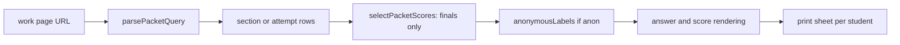

# Reporting views, printable work packets and run comparison

The `lib/reporting/` directory holds the pure logic behind the teacher's results pages. Each module takes rows already loaded by a route or page and returns labels, orderings or selections; none of them reads the database. Routes and pages under `app/dashboard/[id]/results/` draw what these return. Score rules themselves (which score counts, how a rescore supersedes) live in [scoring and results](scoring-and-results.md); this page covers how those finals are presented and compared.

## Modules and what they own

| Module | Owns | Consumed by |
|---|---|---|
| `workPacket.ts` | URL contract of the class packet, anonymous labels, which score row prints, item selection and ordering, checkbox lines | `app/dashboard/[id]/results/work/page.tsx` |
| `runComparison.ts` | Agreement statistics between an AI run and teacher finals | `scripts/compare-runs.ts` |
| `answerView.ts`, `shortTextView.ts`, `fillBlankView.ts`, `rubricScoreView.ts` | Plain, printable rendering of each answer type and rubric | results pages, work packet |
| `answerHistoryView.ts` | Labels for an earlier saved answer version and why it was captured | per-student page history list; restore flow in [scoring](scoring-and-results.md) |
| `printSummary.ts`, `printIntegrity.ts`, `printFeedback.ts` | Cohort summary, integrity wording, feedback selection for `results/print` | the print report |
| `timeline.ts` | Turns attempt events into readable timeline lines; `durationLabel`, `speechPreflightText` | per-student page |
| `analytics.ts` | Per-item statistics and mean formatting | `results/analyticsQuery.ts`, and the class-insights evidence pack in [integrations](integrations.md) |

Essay answers are rendered by `renderEssayAnswerHtml` in `lib/richText/`, not by this directory; see [rich-text essays](authoring.md#rich-text-essays).

## The class work packet

The packet is a printable PDF-ready page: one sheet per student, an inch of margin for annotation, checkboxes on each multiple-choice option, and scores from the teacher, the AI, both or neither. Its design note is `docs/student-work-export-design.md`, and the page header records the FERPA posture: unlike the results print report, this page deliberately prints student names, numbers and written answers, and only on the teacher's explicit action for their own assessment. Failures are `notFound()` so the URL cannot probe for other assessments.

URL contract (`parsePacketQuery`, `PacketQuery`):

- `section` is required for a class packet (one PDF per section). Without it the page shows a screen-only list of sections with handed-in work and prints nothing.
- `attempt=<uuid>` prints one student's work with no section. Unlike the section packet, it may name an in-progress attempt.
- `items` is a comma list or repeated values from the toolbar checklist; `questions=0` prints answers only; `scores` is `none | teacher | ai | both`; `anon` switches to labels with a teacher key page last; `spacing=double` double-spaces essay answers.
- The last repeated value wins, and every malformed value falls back to a default. The parser never returns a 400.

Behaviour that matters for changes:

- **Score selection** (`selectPacketScores`): the packet reads finals only. Superseded rows, `research` rows and unfinished proposals never print. The test `superseded-scores.test.ts` ("the work packet never prints a superseded row") pins this.
- **Anonymity** (`anonymousLabels`, D-1): labels are stable per attempt id; the name-to-label mapping appears only on the teacher key page, so a packet can leave the teacher's hands.
- **Ordering** (`packetOrdering`) and item selection are pure; `stemExcerpt` makes the toolbar's item labels short.

Caption: the packet is a pure pipeline after the page loads its rows; the only database reads happen in the page.

## Run comparison (scoring corpus)

`compareRun` (`lib/reporting/runComparison.ts`) answers "is this prompt or model good enough" by comparing one scoring run's `research` rows to teacher finals on the same responses. `comparisonToCsv` writes several runs side by side. `scripts/compare-runs.ts` loads the rows and calls these functions; the corpus that creates the runs is described in [scoring and results](scoring-and-results.md).

Reported statistics:

- `n` (research rows), `with_human_final`, `exact_agreement` and `mean_abs_points_diff` over pairs with a final, and `mean_abs_diff_fraction`, the scale-free version (gap divided by the human row's maximum, so rubrics of different sizes compare).
- `criterion`: per-criterion level agreement, counted only where both the AI and the human rationale carry `criterion_scores`, because a teacher may override with bare points.
- `hybrid_auto_finalize_rate`: the share of rows whose confidence would have auto-finalised on a hybrid item at `HYBRID_AUTO_FINALIZE_CONFIDENCE` (from `lib/ai/essayScorer/scoreCore.ts`), which measures how much work a teacher would never see.

The module is deliberately identifier-free: a pair carries response and item ids only, and nothing in it reaches the database. Its inputs must match the `criterion_scores` shape both the AI and human paths write; the header comment in `runComparison.ts` documents that contract.

## Change navigation

- **Changing the packet URL or flags**: edit `parsePacketQuery` and `PacketQuery` first, then `work/page.tsx`. Keep the never-throw rule; the test file `work-packet.test.ts` has a `parsePacketQuery` suite.
- **Changing what prints for a score**: `selectPacketScores` and `packetScoreHeading`. Any score reader must filter `status = 'final'` (see [scoring](scoring-and-results.md)).
- **Changing an answer's printed form**: the `*View.ts` renderer for that type, plus `renderEssayAnswerHtml` for essays. Escape all text; the renderers feed HTML.
- **Changing run statistics**: `runComparison.ts`, with `run-comparison.test.ts` (`compareRun`, `comparisonToCsv`). It needs no database.
- **Focused checks**: `cd design-tool && bun test test/work-packet.test.ts test/run-comparison.test.ts`. For print helpers and timeline, add `test/reporting-print-helpers.test.ts` and `test/reporting-timeline.test.ts`. The packet page's markup is in `test/work-packet-page.test.tsx`.
- **Scope boundary**: this is a read-only area. A change here should not need a migration or a route change unless the URL contract changes. Checks against the test database are needed only for DB-backed suites such as `superseded-scores.test.ts`, which can be run per [testing](../testing/testing-and-validation.md).

Related: [scoring and results](scoring-and-results.md) (which finals exist), [integrations](integrations.md) (Google Docs and gradebook consume the same finals), [sittings and attempts](sittings-and-attempts.md) (the events the timeline reads).
