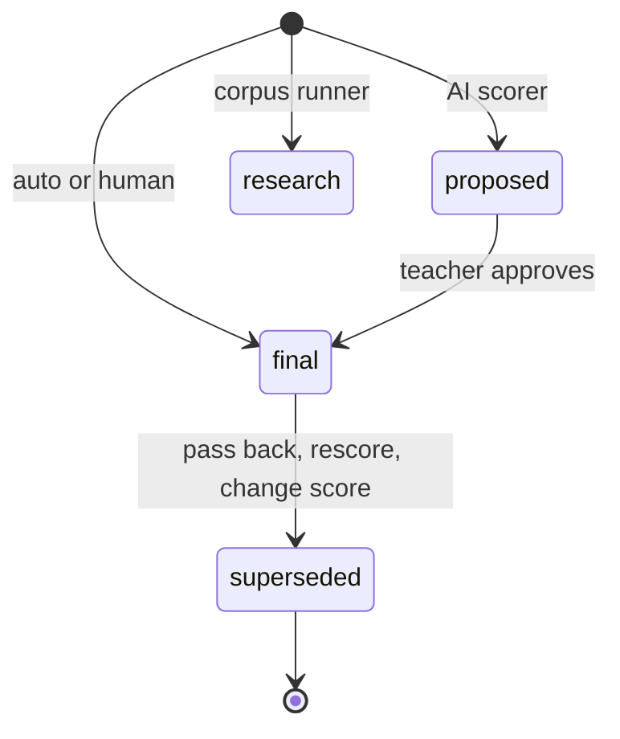

# Scoring, results and score corrections

Scores live in the append-only `scores` table (see [data model](data-model.md#tables-by-domain)). Every response can accumulate rows; the history is the audit trail. This page explains who writes which row, and how corrections keep that history intact.

## Who writes a score

| Method | Producer | Status written | Entry point |
|---|---|---|---|
| `auto` | Deterministic key comparison | `final` directly | `scoreResponse` in `lib/scoring/auto.ts`, driven by `runAutoScoringPass` in `lib/scoring/runAutoScoring.ts` |
| `ai` | Essay scorer provider | always `proposed` (a human finalises) | `lib/scoring/aiScoreResponse.ts`, routes `score-ai` (per attempt) and `rescore-ai` (per response) |
| `hybrid` item setting | AI, then confidence gate | `final` when confidence is at least `HYBRID_AUTO_FINALIZE_CONFIDENCE`, else `proposed` | `aiScoreResponse.ts` |
| `human` | Teacher | `final` | `app/api/responses/[responseId]/score`, `app/api/scores/[scoreId]/approve` |

`effectiveScoringMethod(type, config)` in `lib/api/items.ts` resolves the item's method: an explicit `items.config.scoring_method` wins, otherwise MC and short text are `auto` and essays are `human`. The schema's `ScoringMethodSchema` is `auto | ai | human | hybrid`.

### Auto-scoring rules (`lib/scoring/auto.ts`)

- Multi-select MC is exact-set, all or nothing.
- Short text compares plain normalised text first (trim, collapse whitespace, case-fold). Only if that fails does it try, in order, numeric equivalence (`1/2` equals `0.5`, switched off per item by `exact_form`) and a formula fold (strips `$`, `\mathrm`, braces and subscripts so `H_2O` equals `H2O`, but `^` is kept because exponents change value). Each later step can only add matches.
- Table items score per keyed cell; fill-in-blank per keyed blank (`tableMaxPoints`, `fillBlankMaxPoints`). Items with no key return `null`, which callers count as skipped, never as zero.
- `runAutoScoringPass` is idempotent: it skips responses that already have a `final`, and ignores `research` rows when deciding that.

When the pass runs: in the same request as the student's own hand-in (`app/api/attempts/[attemptId]/submit/route.ts`) and on demand from the teacher score route. A scoring failure is logged and never fails the hand-in.

## Score status lifecycle

Score statuses on a response row. `research` rows are written only by the scoring-corpus runner and are invisible to teacher surfaces.

- The partial unique index `scores_one_final_per_response_unq` allows one `final` per response. Superseding frees the slot so the next hand-in (or the correction itself) can write a new final.
- **Pass back** (`lib/api/passBackAttempt.ts`): one transaction flips a submitted attempt to `in_progress`, supersedes every `final`, and records a `passed_back` event. `proposed` rows are left alone. A timed assessment requires a new deadline, written to `deadline_override_at`.
- **Rescore with current key** (`lib/scoring/rescore.ts`): `planRescore` is pure; `applyRescore` supersedes only `auto` finals whose answer now scores differently and inserts a new `auto` final with `rationale.changed_from`. Teacher-set scores are counted but never overwritten.
- **Change score** (`lib/api/changeScore.ts`): supersedes a `final` with a new human final and writes a `score_changed` event.
- **Answer restore** (`lib/api/restoreAnswer.ts`, `lib/api/answerHistory.ts`): a teacher can make an earlier saved text version current; dependent scores are superseded and an `answer_restored` event is written.

Staff-only event kinds (`STAFF_ONLY_ATTEMPT_EVENT_KINDS`) are written by these routes and can never be posted by the client ([sittings and attempts](sittings-and-attempts.md#events-and-the-monitor)).

## Teacher review queue and approval

Human scoring is driven from a per-assessment queue rather than from each attempt.

- `GET /api/assessments/[id]/review-queue` (`view` access) lists responses on the assessment's **submitted, non-practice** attempts whose item's effective method is not `auto` and that have no `final` row. Auto items never appear (they were finalised at hand-in), and neither do practice hand-ins. Each entry is grouped by `proposed`: `null` means "needs a manual score", a non-null proposal means "AI suggestion awaiting approve or override". Stems reach the queue rendered, so teachers score a fraction, not KaTeX source.
- **Manual score** (`app/api/responses/[responseId]/score`) and **change score** share `checkManualScore` in `lib/api/reviewActions.ts`. `max_points` must equal the item's own maximum (rubric max, table cells, fill-blank count, otherwise 1), so every student's totals stay comparable. When `criterion_scores` are sent they are validated against the scoring view, which expands single-point rubrics into the derived `.below/.meets/.exceeds` levels the queue offers.
- **Approve** (`app/api/scores/[scoreId]/approve`) inserts a new `final` row copying the AI proposal's numbers and rationale. The method stays `ai` and the scorer stays the model id, while `reviewed_by_sub` records the approving teacher. The proposal row stays as audit trail. Approve refuses a `research` row as `not_found`, a non-proposal as `not_a_proposal`, and a response that already has a final as `409 final_exists`; the insert uses `onConflictDoNothing` to close the race with a concurrent score.
- Every action in this chain loads the response through `loadResponseChain`, which uses `authorizeAttempt(..., "edit")` and returns `404` for other teachers' rows, and `400 attempt_not_submitted` for unsubmitted attempts.

Invariant: approval and manual scoring never edit a row. They only append a `final` and let the partial unique index arbitrate races. Test focus: `review-queue.test.ts` and `change-score.test.ts`.

## Teacher review queue and approval

`GET /api/assessments/[id]/review-queue` (view level, `authorizeAssessment`) lists what still needs a human on one assessment: responses of submitted, non-practice attempts whose effective method is not `auto` and that have no `final`. Auto items never appear, because they were finalised at hand-in, and a staff member's own practice attempt never waits in the class queue. The queue splits by the `proposed` score: `null` means a manual score is needed, and a non-null value is an AI proposal awaiting approve or override.

The write paths share `lib/api/reviewActions.ts`:

- `loadResponseChain` loads response, attempt and item. It authorises at `edit` level (another teacher gets 404), requires a submitted attempt (`attempt_not_submitted` otherwise), and ignores `research` rows when it checks for an existing final.
- `checkManualScore` is the rule for a hand-given score, used by the manual score route (`app/api/responses/[responseId]/score`) and by change score. `max_points` must equal the item's own maximum (rubric total, table cells, fill-blank count, or 1), and any criterion picks are validated against the item's scoring view.
- `POST /api/scores/[scoreId]/approve` (`app/api/scores/[scoreId]/approve/route.ts`) is append-only. It inserts a new `final` row that copies the proposal's points, maximum, rationale and scorer, keeps `method: ai` because the model did the scoring, and sets `reviewed_by_sub` to the approving teacher. The proposal row stays as audit trail. A `research` row answers 404, a row that is not a `proposed` score answers 400 `not_a_proposal`, and an existing final answers 409 `final_exists`. The insert is also `onConflictDoNothing`, which closes the race between the check and the write.

Invariant: approval never edits the proposal, and an override goes through the manual score or change score path instead. Focused test: `review-queue.test.ts`; the change-score rules are in `change-score.test.ts`. An attempt enters the queue only once it is submitted, by student hand-in or teacher hand-in ([sittings and attempts](sittings-and-attempts.md)).

## Results and reporting

- `buildResults` (`lib/scoring/results.ts`) builds the teacher matrix of submitted, non-practice attempts by items. Only `final` scores count; unfinished cells report `proposed_pending`, `unscored` or `no_response`. `max` is an assessment-level constant (rubric max for rubric essays, keyed-cell count for tables, otherwise 1), and `percent` stays blank until every cell is scored.
- Reporting views (matrix, per-student page, print report, and the printable work packet) render at `app/dashboard/[id]/results/*`; their pure logic lives in `lib/reporting/` and is described in [reporting views, printable work packets and run comparison](reporting-and-packets.md).
- **Instant feedback** (`lib/feedback/buildFeedback.ts`, `attemptFeedback.ts`): settings `student_feedback` (`off | score | right_wrong | answers`) and `answers_release` (`at_hand_in | on_release`) on the assessment. The submit route builds feedback from the finals the same request just wrote, only for the student's own hand-in and never after a pass back, and records a `feedback_shown` event. Answer keys reach the student only at the `answers` level and after release (`app/api/assessments/[id]/release-answers`).
- Essay scoring is driven by the rubric stored on the item (`items.config.rubric`, `RubricSchema` in [wire formats](../architecture/wire-formats.md)); the rubric library and rubric extraction are covered in [authoring](authoring.md). AI provider plumbing and the guardrail that wraps scoring calls are in [AI and safeguarding](ai-and-safeguarding.md).
- The scoring corpus (`lib/scoring/corpus.ts`, `scripts/score-corpus.ts`) replays essays a teacher already settled to measure a prompt or model against the human final; it writes `research` rows tied to a `scoring_runs` label. `scripts/compare-runs.ts` reports agreement for those runs through `lib/reporting/runComparison.ts` ([reporting and packets](reporting-and-packets.md#run-comparison-scoring-corpus)).

Downstream consumers of finals are the gradebook push and Google Docs release in [integrations](integrations.md).

## Change navigation

- Start with `lib/scoring/auto.ts` for scoring rules, `lib/scoring/results.ts` for totals, and the specific `lib/api/*` module for a correction flow.
- Anything that reads scores must filter on `status = 'final'`; a reader that does not will double count or show superseded or research rows.
- A new scored item type needs a branch in `scoreResponse`, an `itemMax` entry in `results.ts`, and the type-exhaustive switches described in [wire formats](../architecture/wire-formats.md#add-an-item-type-cross-system-expensive).
- Focused tests: `scoring-auto.test.ts`, `scoring-numeric-equivalence.test.ts`, `scoring-math-fold.test.ts`, `scoring-method.test.ts`, `results.test.ts`, `rescore.test.ts`, `change-score.test.ts`, `superseded-scores.test.ts`, `essay-scorer.test.ts`, `review-queue.test.ts`, `instant-feedback-*.test.ts`.
- Do not run the whole suite for a pure scoring-rule change; the DB-backed files above are enough. All of them need the test database ([testing](../testing/testing-and-validation.md)).
