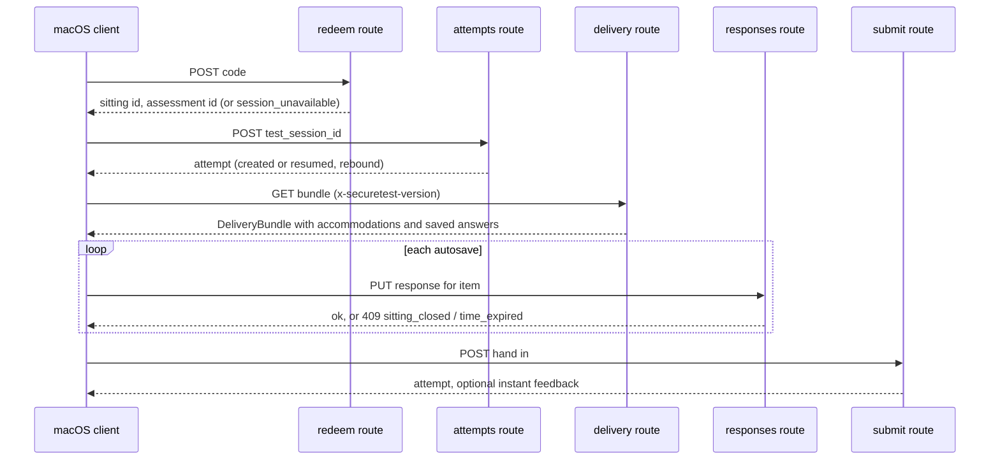
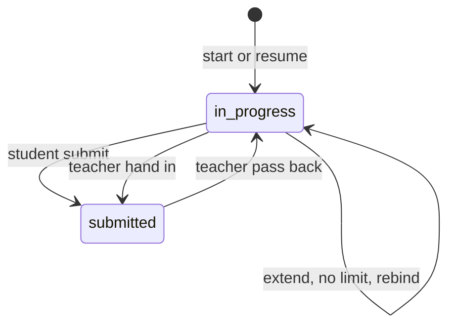

# Sittings, attempts and the student plane

The student plane is the set of routes a signed-in student (or a staff member practising) uses once a teacher has started a test. It is gated by `requireStudentOrPractice()` and by roster scope, as described in [auth and access](auth-and-access.md); the client side of every call is in [client overview](../client/overview.md).

## Vocabulary

- **Sitting** (`test_sessions`): one teacher-started run of one assessment. It owns a 6-character join code, a scope (all the owner's current sections, one `section_ps_id`, or an explicit `student_ps_ids` list) and an `expires_at`. Status is `open` or `closed`. `kind` is `class` or `practice`.
- **Attempt** (`attempts`): one student's work on one assessment. There is a unique constraint on `(assessment_id, student_id)`, so joining a second sitting of the same assessment resumes the same attempt and rebinds `test_session_id` to the new sitting.
- **Practice sitting**: a staff member sitting their own test on their own Mac. The attempt has `practice = true`, the student row is a `practice_for_sub` overlay, and every class reader (results, CSV, print, review queue, analytics, hand-in-all, corpus) filters practice attempts out.

## Join and answer flow

Join, bundle fetch, answer writes and hand-in. The server runs auto-scoring and safeguarding screening inside the submit request.

1. **Redeem** (`app/api/test-sessions/redeem/route.ts`). The code is normalised (`normalizeCode`: trim, uppercase, drop spaces and dashes) and must be well formed against `CODE_ALPHABET`, which omits `0/O`, `1/I/L` and lowercase. The sitting must be `open` and `expires_at > now`. Then `resolveStudentForOwner` (`lib/api/resolveStudent.ts`) decides identity and scope. `not_on_roster` and `not_in_sitting` are both answered as `404 session_unavailable`, the same as an unknown code, so a student cannot probe which codes are live. `no_email` and `identity_conflict` are returned as-is because they are facts about the caller's own account.
2. **Start or resume** (`app/api/attempts/route.ts`). It repeats the scope check against the sitting, inserts or finds the attempt, rebinds it to the new sitting (`rebindIfMoved`) and applies the sitting-wide "No time limit" flag (`applySittingNoLimit`).
3. **Bundle** (`app/api/assessments/[id]/delivery/route.ts`, `lib/api/buildDeliveryBundle.ts`). Authorised by the existence of the caller's own attempt. The mapping is an exhaustive switch over `ITEM_TYPES` with an `assertNever` default, and the result is parsed through `DeliveryBundleSchema` as a last backstop ([wire formats](../architecture/wire-formats.md)). Match and order options get per-attempt ids from `opaqueId` (`lib/api/opaqueIds.ts`, HMAC keyed by `DESIGN_TOOL_DELIVERY_SECRET`), and the write routes translate them back before storing. `requiredClientUpgrade` (`lib/items/clientSupport.ts`) refuses a bundle the client's `X-SecureTest-Version` cannot render, before any lockdown begins. Effective accommodations are resolved here ([accommodations and roster](accommodations-and-roster.md)). The bundle also carries the attempt's saved answers and uploads, `time_limit_ends_at` plus `server_now`, and `allow_clipboard` only when true.
4. **Write** (`app/api/attempts/[attemptId]/responses/[itemId]/route.ts`). `PUT` is an upsert on `(attempt_id, item_id)`. Order of checks: `loadOwnAttempt` (404 for another student's attempt, never 403), `attemptAcceptsWrites`, `refuseIfSittingOver`, `refuseIfPastDeadline`, item lookup, then `response.type` must equal `item.type`. Text answers are copied into `response_revisions` first (`captureBeforeWrite`). Drawings reference an upload slot the server minted for that exact attempt and item (`response_uploads`, presigned S3 upload where available).
5. **Submit** (`app/api/attempts/[attemptId]/submit/route.ts`). Idempotent: a repeat returns the attempt with `already_submitted`. After the guards it sets `status = submitted`, schedules safeguarding screening, runs the auto-scoring pass and builds instant feedback; failures in those three never fail the hand-in ([scoring](scoring-and-results.md), [AI and safeguarding](ai-and-safeguarding.md)).

## Clocks

Two independent clocks refuse student writes, and each has a grace period for the autosave already in flight.

| Clock | Decider | Grace | Meaning |
|---|---|---|---|
| Time limit | `deadlineFor(attempt, assessment)` in `lib/api/attemptDeadline.ts` | `DEADLINE_GRACE_SECONDS` = 30 | Per attempt. Order of precedence: `time_limit_removed` (null), then `deadline_override_at`, then `started_at + time_limit_seconds`. A non-positive limit means no limit. |
| Sitting over | `sittingIsOver` in `lib/api/sittingOver.ts` | `SITTING_CLOSE_GRACE_SECONDS` = 10 for writes, none for the peek poll and submit | The teacher pressed Close, or `expires_at` passed. Expiry is read lazily, with no timer. |

Neither clock hands the attempt in. The client ends the secure session, the attempt stays `in_progress` and resumable through a later sitting, and finalising is the teacher's hand-in (`app/api/attempts/[attemptId]/hand-in`, `app/api/test-sessions/[sessionId]/hand-in-all`) or the student's Finish later. A student's own submit after the deadline is refused (409), so only the teacher's route stays open.

## Attempt lifecycle

Attempt status. Extending, removing the limit and rebinding to a new sitting change deadline columns, not status. Pass back supersedes final scores in the same transaction ([scoring](scoring-and-results.md#score-status-lifecycle)).

Teacher actions on a live sitting live under `app/api/test-sessions/[sessionId]/*` (`close`, `extend`, `attendance`, `hand-in-all`) and `app/api/attempts/[attemptId]/*` (`extend`, `hand-in`, `pass-back`). Each authorizes through `authorizeSitting` or `authorizeAttempt` at `run` level; deleting an attempt requires `own` and leaves an `attempt_deletions` audit row (`lib/api/deleteAttempt.ts`).

## Events and the monitor

- Clients post telemetry to `POST /api/attempts/[attemptId]/events`. The accepted kinds are the closed set `CLIENT_ATTEMPT_EVENT_KINDS` in `db/schema.ts`; the Swift mirror is `AttemptEventKind` in the client ([lockdown and security](../client/lockdown-and-security.md)). Kinds recording staff actions (`teacher_hand_in`, `deadline_extended`, `passed_back`, `gradebook_sent`, `score_changed`, `feedback_shown`, `answer_restored`) are server-written only.
- `ALERT_EVENT_KINDS` (`quit`, `emergency_exit`, `focus_loss`, `lockdown_failed`, `lockdown_interrupted`, `client_error`) light "Needs attention"; `focus_regained` clears only `focus_loss`.
- Attendance (`lib/api/sittingAttendance.ts`) resolves the sitting's expected students from the roster live and joins them to attempts. A joined student who left the scope stays visible, and `submitted_earlier` explains why a student who already handed in elsewhere cannot start a fresh attempt.
- **Peek**: a teacher requests a screenshot (`peek_requests`); the client polls `peek/pending` every 5 seconds, shows the student a notice first, renders itself and uploads a JPEG. Windows in `lib/api/peek.ts`: 10 s rate limit per attempt, 30 s pending TTL, 60 s image TTL (delete-on-read, lazily swept), 2 MB base64 cap.

## Drawing uploads

Drawing-upload items (photo or scan of paper work) take bytes through a three-step slot, so the answer can only point at a file the server registered for that exact attempt and item:

1. `POST .../responses/[itemId]/upload-url` (`registerUpload` in `lib/api/responseUploads.ts`) checks the content type against `ALLOWED_UPLOAD_TYPES` (PNG, JPEG, HEIC, PDF) and the declared `content_length` against `UPLOAD_MAX_BYTES` (20 MB), then inserts a `response_uploads` row and returns its id plus a target. The target is a presigned S3 URL where the storage backend supports one; otherwise it is the app's own `PUT .../upload?upload_id=` route. The size cap is applied here, before a URL exists, because a presigned PUT cannot enforce a maximum afterwards.
2. The client sends the bytes. The fallback `PUT` route re-checks ownership of the slot, the size cap and the closed-sitting and deadline guards, because there is no signature to rely on.
3. `markUploadComplete` marks the row settled. The response write then references that upload, and a resumed bundle returns the stored image bytes as `saved_uploads`, which the wire schema caps at 2 MB per drawing ([wire formats](../architecture/wire-formats.md)).

Invariant: a slot is bound to one (attempt, item) and cannot be redeemed by another student. A refused completion after the grace period leaves the canvas unsaved, the same as a late text write. Focused test: `response-uploads-api.test.ts`; the delivery side is covered by `delivery-api.test.ts` ("a drawing answer carries its stored bytes").

## Change navigation

- Start at the route for the verb you are changing, then `lib/api/studentAttempt.ts` (`loadOwnAttempt`, `loadItemForAttempt`, `loadJoinableSitting`) for shared student-side loading.
- Any new student write door must ask both clocks (`refuseIfSittingOver` then `refuseIfPastDeadline`); the three existing doors are the response write, the drawing-slot completion and submit.
- New bundle fields must be additive and emitted only when meaningful, so older bundles stay byte-identical; add the field to `DeliveryBundleSchema` first.
- Focused tests: `test-sessions-api.test.ts` (codes, scope), `resolve-student.test.ts`, `attempt-ingest-api.test.ts` (write guards, 42 KB), `delivery-api.test.ts` (no answer key anywhere in the body; sealing round trips), `attempt-deadline.test.ts`, `sitting-closed.test.ts`, `sitting-over.test.ts`, `attempt-events-api.test.ts`, `peek-api.test.ts`, `attempt-pass-back-api.test.ts`, `attempt-extend-api.test.ts`, `session-hand-in-all-api.test.ts`, `practice-sitting.test.ts`, `practice-invisibility.test.ts`, `sittings-attendance-api.test.ts`.
- These are DB-backed and require the `_test` database; see [testing](../testing/testing-and-validation.md). For roster scope see [accommodations and roster](accommodations-and-roster.md); for the persisted columns see [data model](data-model.md).
