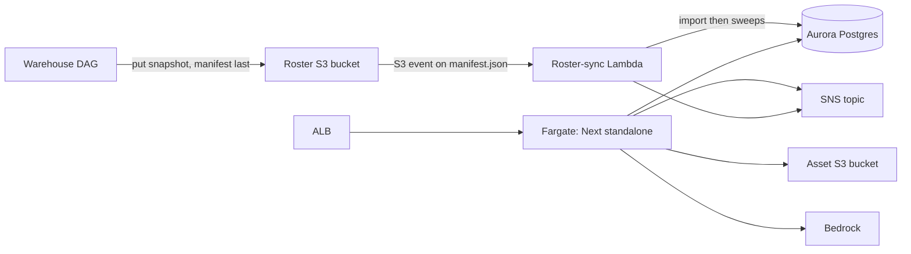

# Deployment, infrastructure, observability and retention

Consult this page when changing how the design tool is built into an image, started in Fargate, migrated, monitored or pruned. The runtime pieces are small; most of the risk is in the rules about what may reach logs and which paths bypass the web app.

## Packaging (`design-tool/Dockerfile`)

- Build from the **repository root** (`docker build -f design-tool/Dockerfile .`) because the bun workspace needs `packages/` in the context. The builder stage uses node 22 (Next's CLI needs node) with bun 1.3.6 copied in as package manager; the runner stage is plain node with the Next standalone output.
- No network during `next build`: fonts are vendored under `app/fonts/`.
- Operator scripts are bundled with `bun build --target=node` because the runtime image has no bun and the standalone trace does not carry drizzle/postgres as resolvable modules: `db/migrate.mjs`, `scripts/score-corpus.mjs`, `compare-runs.mjs`, `seed-essays.mjs`, `roster-health.mjs`, `ps-reach.mjs`, `student-lookup.mjs`.
- `ARG APP_COMMIT` is stamped into `APP_COMMIT` and surfaced by `GET /api/health` (no auth, no database, so an Aurora hiccup cannot recycle tasks) and by `feedback.app_commit`.

## Container entrypoint (`scripts/docker-entrypoint.mjs`)

At boot it assembles `DATABASE_URL` from `DB_*` variables that ECS injects from the Aurora credentials secret (a pre-set `DATABASE_URL` wins, for local docker runs), then starts the Next server. A first argument selects a one-off mode instead of the server: `migrate`, `corpus`, `compare`, `seed-essays`, `roster-health`, `ps-reach`, `student-lookup`. Any other argument is refused so a stray invocation cannot boot a web server with no load balancer. The one-off modes are how operators reach Aurora, since the cluster security group has no laptop ingress (they run as an ECS run-task on the service's own task definition). `db/migrate.ts` takes a Postgres advisory lock so concurrent boots serialise ([data model](../design-tool/data-model.md#migrations)). Test: `design-tool/test/docker-entrypoint.test.ts`.

## Infrastructure as code (`design-tool/infra`, CDK)

| File | Owns |
|---|---|
| `bin/design-tool.ts` | App entry. Account-specific values (OAuth client ids, hostname, guardrail id, notify and admin emails, producer role ARNs) are read from the gitignored CDK context, never committed. |
| `lib/design-tool-stack.ts` | `DesignToolStack`: VPC without NAT, Aurora Postgres Serverless v2 (min 0 ACU, security-group-gated, no CIDR ingress), the per-env asset bucket (`secure-test-design-tool-<envName>`, retained only for `prod`), the SNS alarm/feedback topic, and wiring to the two constructs below. |
| `lib/app-service.ts` | The Fargate service and ALB; maps secret keys to `DB_*` env vars and pins the production provider choices: `STORAGE_PROVIDER=s3`, the AI/PDF/rubric/essay-scorer/math/guardrail/screener providers = `bedrock`, `NOTIFY_PROVIDER=sns`, `GRADEBOOK_PROVIDER=live`, `EMAIL_PROVIDER=ses`; `ADMIN_EMAILS` comes from context. |
| `lib/roster-sync.ts` + `lambda/roster-sync.ts` | The roster snapshot bucket (S3 notification on the `manifest.json` key only), the in-VPC importer Lambda that calls `lib/roster/syncHandler.ts`, an errors alarm to SNS, and cross-account put-only access for the warehouse DAG. |
| `lambda/deleteStoredUpload.ts` | Deletes stored drawing/upload bytes for swept practice attempts (grant scoped to `responses/*`). |
| `scripts/*.sh` | `deploy.sh`, `migrate-aurora.sh`, `oneoff-aurora.sh`, `query-aurora.sh`, `ai-usage.sh`. |

Why Fargate and not Amplify: ADR 0014 (Amplify supports Next 12-15 only, has a 30 s response timeout and cannot join the VPC). The first-deploy walk-through lives in `design-tool/infra/README.md` and `docs/ecs-deploy-plan.md`, which are not part of this wiki's evidence set.

The roster path is a push from the warehouse; the web app and the Lambda share Aurora but only the app can reach Bedrock.

## Retention sweep

`lib/retention/sweep.ts` runs inside the nightly roster-sync Lambda after the import, best-effort (a failure is logged and never fails the sync, see `callSweepBestEffort` in `syncHandler.ts`):

- `sweepEventTables` deletes `server_error_events`, `client_error_events` and `guardrail_events` older than `RETENTION_DAYS_DEFAULT` = 90 days. `feedback` is never swept.
- `sweepPracticeSittings` deletes practice attempts for practice sittings closed or expired more than `PRACTICE_RETENTION_DAYS` = 7 days ago (through `deleteAttemptRecord`, so the audit row matches a manual delete) and archives the sitting; stored bytes go through the `deleteStoredUpload` path when supplied.
- `sweepAnswerHistory` prunes `response_revisions` (`ANSWER_HISTORY_RETENTION_DAYS`, 30 days after hand-in).
- Peek images are swept lazily from the peek routes (60 s TTL) so no scheduler is needed ([sittings and attempts](../design-tool/sittings-and-attempts.md#events-and-the-monitor)).
- The hourly safeguarding screening retry runs inside the web app (`instrumentation.ts` `register`), because the Lambda has no route to Bedrock ([AI and safeguarding](../design-tool/ai-and-safeguarding.md)).

## Request ids, logs and error capture

- `design-tool/proxy.ts` mints or reuses a request id for every non-static request (`lib/observability/requestId.ts`), sets it on the request and echoes it as the `x-request-id` response header. Error boundaries print it as the "ref" a teacher hands to IT.
- `lib/log.ts` writes one JSON line per event to stdout (CloudWatch). **Redaction contract:** never a request/response body, query string, header, cookie, token, item stem, student answer, name or email; messages and stacks are truncated to 2000 characters. The roster importer logs counts and codes only.
- `instrumentation.ts` `onRequestError` calls `recordServerError` (`lib/observability/serverError.ts`), which writes one error log line and one `server_error_events` row joined by `request_id`. Node runtime only.
- The [student client](../client/lockdown-and-security.md#telemetry-and-diagnostics) reports out-of-attempt errors to `POST /api/client-errors` (`client_error_events`); in-attempt errors travel as `client_error` attempt events. Teachers' feedback goes to `POST /api/feedback` (`feedback`, published to SNS through `lib/notify`, with failures swallowed so a teacher never sees a 500 because SNS hiccuped).
- `GET /api/debug/throw` and `/dashboard/debug/throw` exist to prove the capture path end to end.

## Secrets and configuration

Names only (values never belong in the repo): `DATABASE_URL` (or `DB_*` in ECS), `DESIGN_TOOL_SESSION_SECRET`, `DESIGN_TOOL_PKCE_SECRET`, `DESIGN_TOOL_DELIVERY_SECRET`, `OIDC_ISSUER`/`OIDC_CLIENT_ID`/`OIDC_CLIENT_SECRET`/`OIDC_AUDIENCE`, `ADMIN_EMAILS`, the provider selectors (`AI_PROVIDER`, `MATH_TRANSLATOR_PROVIDER`, `PDF_EXTRACTOR_PROVIDER`, `ESSAY_SCORER_PROVIDER`, `RUBRIC_EXTRACTOR_PROVIDER`, `GUARDRAIL_PROVIDER`, `SAFEGUARDING_SCREENER_PROVIDER`, `STORAGE_PROVIDER`, `EMAIL_PROVIDER`, `NOTIFY_PROVIDER`, `GRADEBOOK_PROVIDER`), and PowerSchool credentials. Sample values live in files the wiki does not read (`design-tool/.env.local.example`, `cdk.context.json.example`). Auth-related variables are explained in [auth and access](../design-tool/auth-and-access.md); AI/guardrail ones in [AI and safeguarding](../design-tool/ai-and-safeguarding.md).

## Change navigation

| Intent | Start at | Check |
|---|---|---|
| New env var or provider | the owning `lib/**/provider.ts`, then `infra/lib/app-service.ts` so the task gets it | `bun run typecheck` |
| New operator one-off | add a `bun build` line in `Dockerfile` and a `MODES` entry in `docker-entrypoint.mjs` | `test/docker-entrypoint.test.ts` |
| Change roster Lambda or sweeps | `lib/roster/syncHandler.ts`, `lib/retention/sweep.ts` | `roster-sync-handler.test.ts`, `retention-sweep.test.ts`, `practice-sweep-asset-delete.test.ts` |
| Change logging or error capture | `lib/log.ts`, `lib/observability/serverError.ts`, `proxy.ts` | `log.test.ts`, `server-error-record.test.ts`, `health-route.test.ts` |

CDK changes are validated by `cdk synth` in `design-tool/infra` (conditional: only when infra files change; it needs CDK context values). Do not run a full image build to check an app-only change.
an app-only change.
